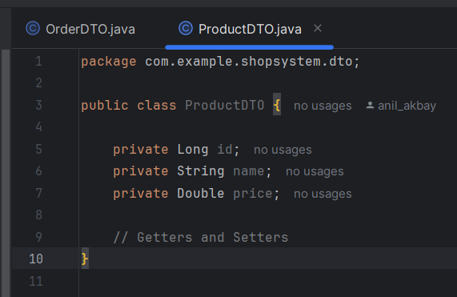

# ShopSystem

ShopSystem, bir e-ticaret uygulaması için geliştirilmiş bir sistemdir. Bu proje, Java ve Spring Boot kullanılarak geliştirilmiştir ve temel özellikleri arasında müşteri yönetimi, sepet işlemleri ve ürün ekleme gibi işlemler bulunmaktadır.

## Özellikler

- **Müşteri Yönetimi**: Müşteriler oluşturulabilir, güncellenebilir ve silinebilir.
- **Sepet Yönetimi**: Sepet oluşturulabilir, ürünler eklenebilir ve çıkarılabilir.
- **Ürün Yönetimi**: Ürünler sisteme eklenebilir ve sepete dahil edilebilir.

## Gereksinimler

- Java 23
- Spring Boot 3.4.0
- Maven
- H2 Veritabanı (Geliştirme için)

## Kurulum

1. Bu projeyi klonlayın veya indirin:
   ```bash
   git clone https://github.com/yourusername/shopsystem.git

2. Maven bağımlılıklarını yükleyin:
   mvn install

3. Uygulamayı çalıştırın:
   mvn spring-boot:run 

4. Uygulama çalışmaya başladığında, http://localhost:8080 adresinden erişebilirsiniz.

## API Endpoints
* GET /api/carts: Tüm sepetleri listeler.
* GET /api/carts/{cartId}: Belirtilen ID'ye sahip sepeti getirir.
* POST /api/carts: Yeni bir sepet oluşturur.
* DELETE /api/carts/{cartId}: Belirtilen ID'ye sahip sepeti siler.
* POST /api/carts/{cartId}/products/{productId}: Sepete ürün ekler.
* DELETE /api/carts/{cartId}/products/{productId}: Sepetten ürün çıkarır.

## Katkıda Bulunma
`Projeyi kendi bilgisayarınıza klonlayın.
Yeni bir özellik ekleyin veya hata düzeltmesi yapın.
Değişikliklerinizi commit edin ve bir pull request oluşturun.` 

# Shop System

Bu projede ürünlerin bulunduğu bir alışveriş sistemi yer almaktadır.

## Ürünler

### Ürün 1


### Ürün 2


### Ürün 3


### Ürün 4


### Ürün 5


### Ürün 6


### Ürün 7


### Ürün 8

